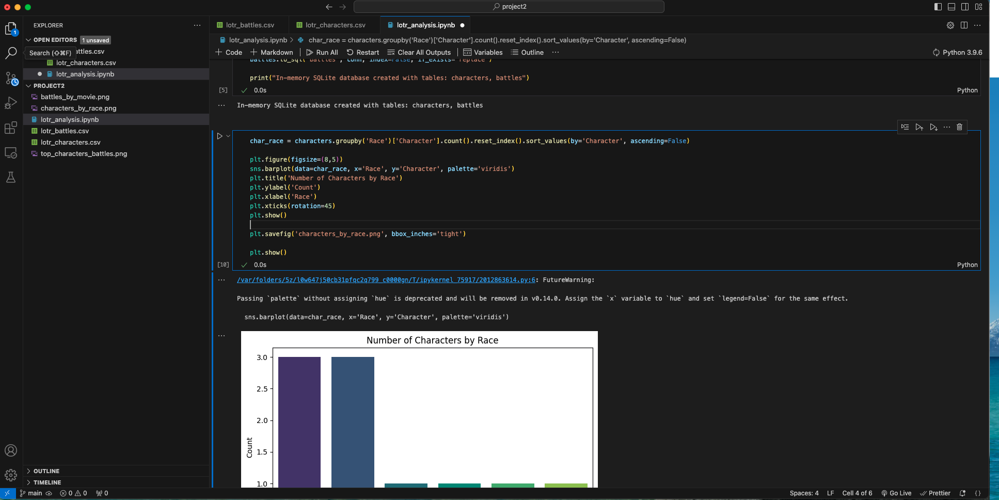
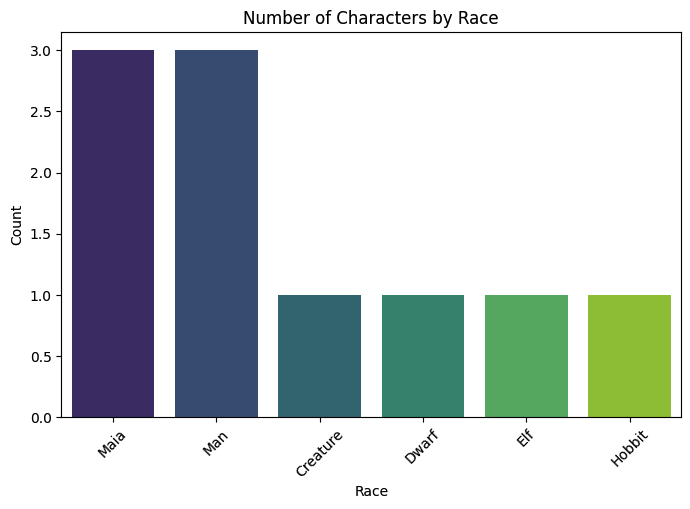
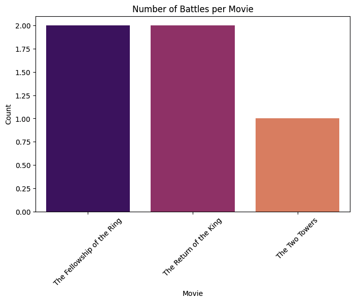
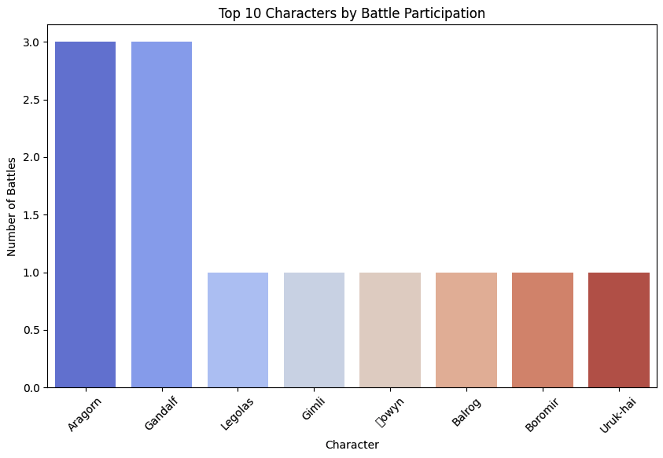

# Exploring Middle-earth: A Data Analysis of The Lord of the Rings
Using **SQL** and **Python**, this project uncovers insights about the heroes, races, and epic moments across *The Lord of the Rings* trilogy. The analysis demonstrates how data can tell stories, even in fantasy worlds.  

## Key Highlights
- Queried a fantasy dataset with **SQLite** to explore characters, races, and battles  
- Visualized race distributions, battle frequency, and main character participation with **Python**, **Matplotlib**, and **Seaborn**  
- Applied storytelling principles to present data insights in an engaging and interpretable way  

## Code Preview

## Data Visualizations
  
*Number of characters by race*  

  
*Number of battles per movie*  

  
*Top 10 characters by battle participation*  
